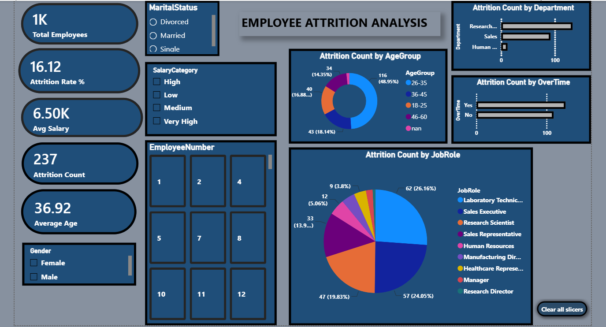

# Employee Attrition Analysis

# Employee Attrition Analysis

## Project Overview
This project analyzes employee attrition using Power BI to identify key factors influencing employee turnover and support HR decision-making.

## Tools Used
- Power BI
- SQL
- Excel
- DAX
- Power Query

## Key KPIs
- Total Employees
- Attrition Rate
- Active Employees
- Average Age
- Average Salary

## Dashboard Features
- Attrition by Department
- Attrition by Job Role
- Attrition by Age Group
- Attrition by Gender
- Attrition by Education
- Salary Analysis

## Key Insights
- Sales department has the highest attrition.
- Younger employees have a higher attrition rate.
- Employees with lower salaries are more likely to leave.
- The dashboard helps HR identify retention opportunities.
